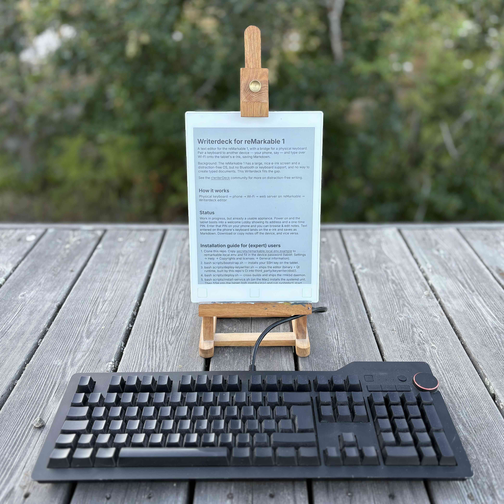

# Writerdeck-keywriter

This is the tablet text editor inside [Writerdeck for reMarkable](https://github.com/bjornte/Writerdeck-for-reMarkable): a Markdown typewriter on a first-gen reMarkable for USB and Bluetooth keyboards.

It is a fork of Dave Singleton’s [remarkable-keywriter](https://github.com/dps/remarkable-keywriter). Writerdeck-server drives it over a unix socket. Do not install this repo alone — deploy through Writerdeck.

Last known-good editor build for automated typing tests: commit `0bb3b70` (all 110 checks passed, including the 38 “basic editing” ones). Everyday builds follow the `master` branch; use that commit hash only if you need to roll back to a proven binary.

Terms: [docs/terms.md](docs/terms.md).



## Testing

The Writerdeck project runs automated typing tests against this editor on the real tablet. Scripted keystrokes travel the same local socket a phone uses; the tests then check the caret, selection, and text. There are about 110 checks; 38 of them are the “basic editing works” set. A separate edit-session check only asks whether opening a note keeps the app alive.

Those tests live in Writerdeck (`scripts/test-keyboard-harness.sh`, `docs/editor-testing/`). This repo does not run them alone.

## What’s different from the original

Dave’s original is a Qt Markdown notepad for reMarkable: USB keyboard, Esc for preview, Ctrl-K note switcher, sundown rendering.

This fork keeps that core and adds what Writerdeck needs:

Socket input. Keystrokes arrive from Writerdeck-server as synthetic Qt key events (QKeyEvent). The stock tablet software cannot load uinput (a fake keyboard device) the usual Linux way.

Mac and Linux shortcuts. Word and line motion, shift-selection, wrap-aware Up/Down, and undo that covers both socket typing and shortcut edits.

EditHelper in C++. Caret math, shortcut handling, wrapped-line motion, and undo live in `edit_helper.*`. QML still owns the on-screen text box, sticky column, timers, and applying results (`edit_mac_helpers.qml.inc`).

Lobby. Files, Home, Settings, and sleep on the tablet; file and vault ops over the same socket (`lobby/`, `lobby_bridge`).

Plain Markdown on disk. Editing stays plain text. Fancy rendering is for preview only.

Building the screen file (QML). Edit helpers and Lobby pieces are modular. After changing them, run `./assemble-qml.sh` and commit the regenerated `main.qml`. Writerdeck’s CI only clones, checks, and compiles — it does not stitch QML together. New editor behavior belongs here, not in Writerdeck’s build script.

## Pulling in Dave’s updates

History is linked to [dps/remarkable-keywriter](https://github.com/dps/remarkable-keywriter) (merge `5946cae`; tree unchanged). Pull from the original on purpose, not every session. In git the remote is often named `upstream` — that just means Dave’s repo:

```bash
git remote add upstream https://github.com/dps/remarkable-keywriter.git   # once
git fetch upstream
git merge upstream/master
# resolve conflicts in favor of Writerdeck where edit/Lobby/socket diverged
git push origin master
```

Prefer a merge commit. Then rebuild Writerdeck via CI, deploy, and run that project’s edit-session and typing tests.

## Credit

Original keywriter: [Dave Singleton](https://github.com/dps/remarkable-keywriter). Writerdeck-specific work is LLM-assisted; behavior is checked on-device by Writerdeck’s typing tests (see Testing above). How to install Dave’s original on its own stays in his repo.
